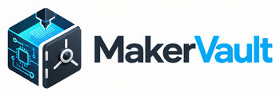
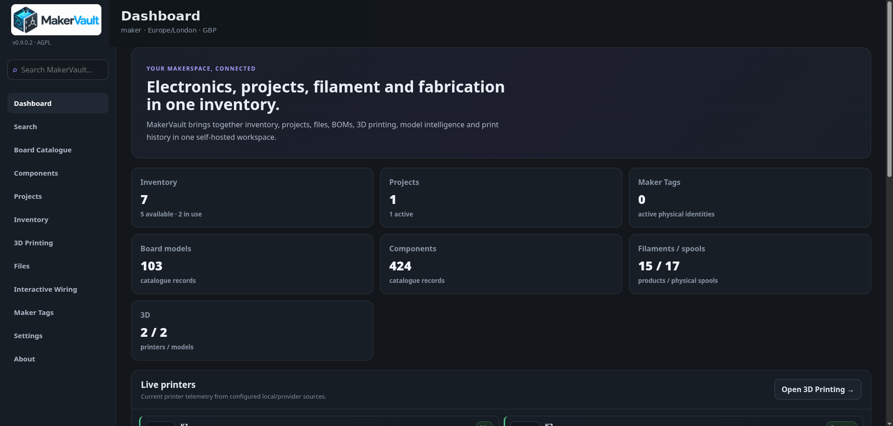

<p align="center">
  
</p>

<h1 align="center">MakerVault User Guide</h1>

<p align="center">
  Public documentation for <strong>MakerVault</strong> — a self-hosted workspace for electronics inventory, projects, files and 3D printing.
</p>

<p align="center">
  <strong>Guide for MakerVault v1.0.4</strong>
</p>

<p align="center">
  <a href="https://gavrd7.github.io/MakerVault-docs/">Read the guide</a> ·
  <a href="https://github.com/gavrd7/MakerVault">Application source</a> ·
  <a href="docs/guide/getting-started/install.md">Installation</a>
</p>

---

## Planned v1.0.5 update (not released)

The next planned release consolidates personal account and server security settings in MakerVault, introduces administrator-managed **Admin / Supervisor / User / Viewer** roles, and adds `python3 scripts/generate_env_secrets.py` for safe two-secret setup. The secure first-run administrator wizard remains a separate draft ([PR #80](https://github.com/gavrd7/MakerVault/pull/80)); development-image publishing is tracked separately ([PR #81](https://github.com/gavrd7/MakerVault/pull/81)). Until the release is published, **v1.0.4 remains stable**. See [application PR #78](https://github.com/gavrd7/MakerVault/pull/78).

## What is MakerVault?

**MakerVault** is a self-hosted workshop management application for electronics, maker projects and 3D printing. It brings together the information that often ends up scattered across spreadsheets, folders, slicers, notes and bookmarks.

At its core, MakerVault connects:

- **catalogue data** for boards and components;
- **physical inventory** for the items you actually own;
- **projects and BOMs** for what you are building and what each build requires;
- **files, revisions and wiring diagrams** for the digital side of a project;
- **printers, filament, spools, models and print history** for 3D-printing workflows;
- **printed parts and Maker Tags** for linking finished physical objects back to their records.

MakerVault runs on your own server using Docker and is accessed through a normal web browser. Your structured data is stored in PostgreSQL and your files remain with your installation. Optional integrations can add live printer status, camera feeds, filament synchronisation, OIDC sign-in and other capabilities, but the core application does not depend on a cloud service.

Filament catalogue matching is optional: MakerVault can merge SpoolmanDB with verified supplemental manufacturer-backed records and authoritative technical data, while manual filament products remain usable when unmatched. K2 camera playback is relayed through MakerVault's own origin, so reverse-proxy deployments do not need a separately published camera media port.

## Development and validation model

MakerVault is an **AI-coded project**. The application codebase has been produced entirely through AI systems working under human direction rather than by a human programmer writing the implementation by hand.

The human maintainer is responsible for the feature ideas, product direction and design decisions, and also performs the hands-on acceptance checks, bug discovery and practical testing used to decide whether changes are ready to merge and release.

Support and future development therefore depend on the capabilities of the available AI tooling, the quality of reproducible reports, and human validation of the resulting changes. AI-generated code and automated CI are not treated as substitutes for real-world testing.


<p align="center">
  
</p>

<p align="center"><em>The MakerVault dashboard brings projects, inventory, printing and workshop activity together.</em></p>

## What the guide covers

This guide documents the stable **MakerVault v1.0.4** release, including:

- beginner-friendly Docker installation from the pre-built GHCR image on Linux, Docker Desktop or WSL2, plus an optional build-it-yourself path and `.env` configuration;
- Docker volumes, bind mounts, backups and restore;
- Dashboard, Universal Search, Board Catalogue, Components and Inventory;
- Projects, BOM allocation, Files and versioned assets;
- 3D Printing, merged filament catalogue matching, physical spools, model library, 3D viewer, print history and Printed Parts;
- live printer monitoring, optional controls and camera feeds, including the K2 same-origin camera compatibility path;
- Maker Tags and Interactive Wiring;
- user accounts, MFA, passkeys, local sign-up, password recovery and storage quotas;
- Spoolman, Creality, SimplyPrint and manufacturer-specific printer integrations;
- reverse-proxy HTTPS plus MakerVault's native HTTPS/Local CA certificate wizard;
- OpenID Connect configuration and SMTP-backed account recovery;
- managed v3 backup/recovery, including TLS identity and replacement-host recovery.

MakerVault v1.0.4 is the current stable patch release, adding project priorities, optional deadlines, attention ranking, deadline highlighting, quick completion and project deletion controls while retaining the v1.0.3 Creality FDM catalogue expansion and earlier v1 improvements. The mandatory v1 acceptance checks were completed on 3 October 2026, including representative off-server recovery, a fresh Debian/Docker installation, restart/persistence checks, native HTTPS/Local CA validation and final green CI.

## Repositories

The application and its documentation are kept separate so each can be maintained cleanly.

| Repository | Purpose |
| --- | --- |
| [gavrd7/MakerVault](https://github.com/gavrd7/MakerVault) | Application source, Docker deployment, GHCR publishing workflow, backend/frontend code and release history |
| [gavrd7/MakerVault-docs](https://github.com/gavrd7/MakerVault-docs) | Public guide source, sanitised screenshots, MkDocs configuration and GitHub Pages publishing |

The published guide is available at **https://gavrd7.github.io/MakerVault-docs/**. Normal MakerVault deployments pull `ghcr.io/gavrd7/makervault:latest`; users can deploy it on a Linux Docker host, Docker Desktop on Windows, Docker Desktop with WSL2 integration, or Docker Engine inside WSL2. Users who prefer to compile it themselves can use the source-build Compose override documented in the installation guide.

## Repository layout

- `docs/guide/` — public guide source
- `docs/guide/assets/` — guide styling, logo and sanitised screenshots
- `mkdocs.yml` — navigation and Material for MkDocs configuration
- `scripts/check_guide_links.py` — generated-site link and fragment validation
- `.github/workflows/guide.yml` — validation and GitHub Pages deployment workflow

## Build locally

```bash
python3 -m venv .venv
. .venv/bin/activate
python -m pip install -r docs/requirements.txt
python -m mkdocs build --strict
python scripts/check_guide_links.py
python -m mkdocs serve
```

See [docs/GUIDE_MAINTENANCE.md](docs/GUIDE_MAINTENANCE.md) for maintenance and publishing guidance.

## Screenshots and privacy

Public screenshots are sanitised before publication to remove private addresses, account details, credentials and local-network endpoints while retaining useful example data.

The guide is designed so screenshots complement the written instructions rather than replace them, keeping it usable when small UI details change.

## Licence and attribution

MakerVault software is licensed **AGPL-3.0-or-later** in the main application repository. Third-party media keeps its original licence and provenance; application media attribution is available in MakerVault's **About** page where applicable.
