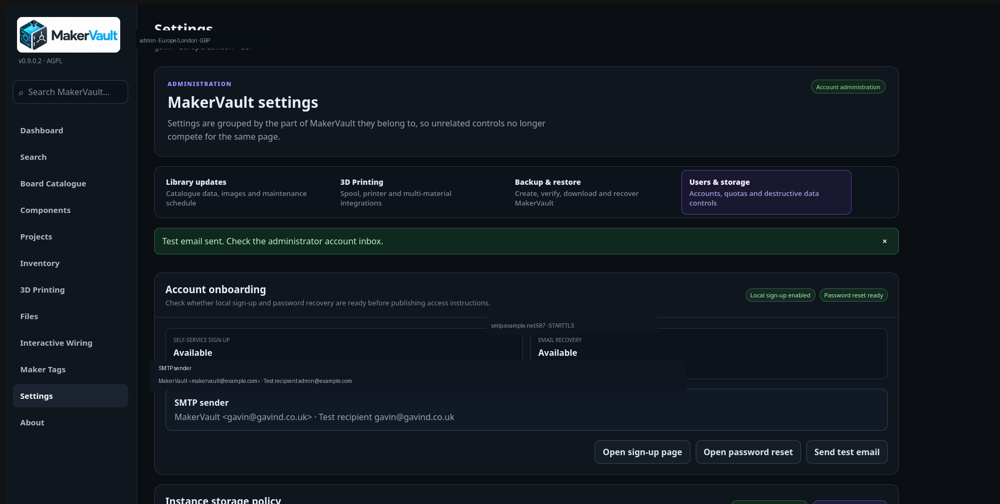
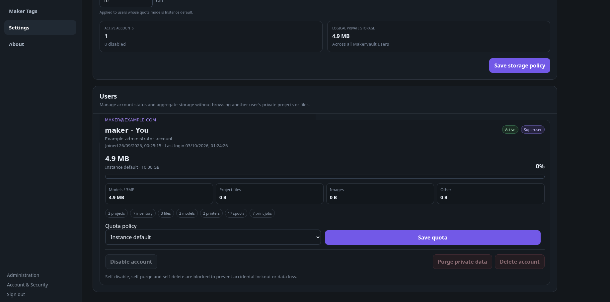
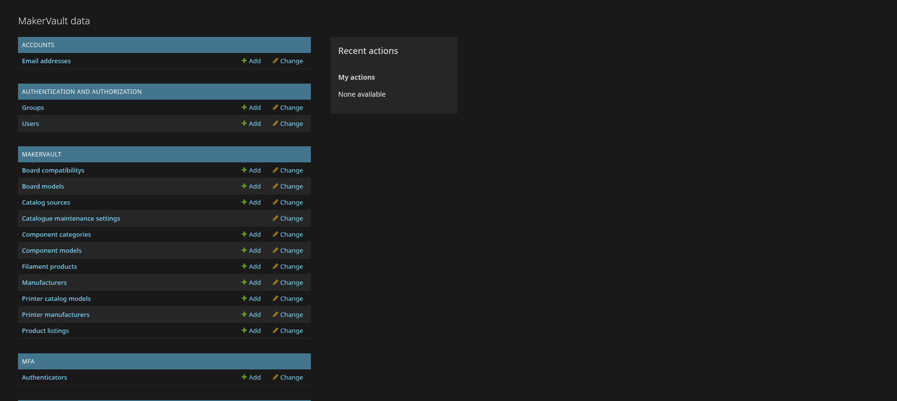

# Accounts and storage

**For the installation administrator**

## Add a local user

1. Sign in as a superuser and open **Administration**.
2. Open **Users** and add a user with a unique username and strong initial password.
3. Save the user, then open **Settings → Users & storage** to assign the appropriate role.
4. Choose Admin, Supervisor, User or Viewer using the role selector.
5. Keep **Active** enabled. Admin is reserved for trusted full-instance administrators.
6. Ask the person to sign in and change their initial password through **Settings → User Account**.

A group grants actions, not ownership of another person's workspace. The default Editor group includes view/add/change core permissions and inventory deletion; it does not grant every delete action. A button may be absent because a specific permission is missing.

Local self-registration is controlled by `ALLOW_LOCAL_REGISTRATION`. When it is enabled, the sign-in area exposes a **Create account** / **Sign up** path; when it is disabled, administrators provision accounts instead. OIDC provisioning is configured separately and does not mean a new identity should automatically become an administrator.

<figure markdown>
  
  <figcaption>The Account onboarding panel shows whether local sign-up and email-based password recovery are ready for users.</figcaption>
</figure>

The **Settings → Users & storage** page provides an account-onboarding status panel for administrators. Use it to confirm whether self-service sign-up is available, whether email recovery is configured, and to send a test email before publishing access instructions.

## What is shared?

Shared catalogue/reference records describe products. Personal inventory, projects, files, printers, spools, models, print history and integration settings are owner-scoped. Current project workspaces are not a general team-sharing system.

The normal administration summary exposes aggregate counts and storage, not a cross-user project/file browser. Nevertheless, the server operator controls the database, code, backups and storage key. Encryption at rest is not end-to-end encryption against that operator.


## Recover an administrator password from the server

If an administrator cannot sign in because they forgot or mistyped their password during first-run setup, the server operator can reset it **without deleting the account, database or Docker volumes**. This requires shell access to the MakerVault host; it is not available to visitors through the web interface.

Run the following from your MakerVault installation directory. For a standard Compose deployment:

```bash
sudo docker compose exec -u makervault makervault python manage.py changepassword YOUR_ADMIN_USERNAME
```

Replace `YOUR_ADMIN_USERNAME` with the **MakerVault login username** (not the container user specified by `-u makervault`). Follow the password and confirmation prompts; the password is not echoed.

If you cannot remember the username, list administrator usernames without displaying password hashes:

```bash
sudo docker compose exec -u makervault makervault python manage.py shell -c "from django.contrib.auth import get_user_model; print(list(get_user_model().objects.filter(is_superuser=True).values_list('username', flat=True)))"
```

**Custom Compose project names or multiple Compose files:** supply the same `-p` and `-f` arguments used when launching MakerVault. For example, the separate PR #80 test installation uses:

```bash
cd ~/MakerVault-PR80
sudo docker compose -p makervault-pr80 -f compose.yaml -f compose.build.yaml \
  exec -u makervault makervault python manage.py changepassword YOUR_ADMIN_USERNAME
```

Do not use `createsuperuser` to recover an existing account, and do not reset the database or remove Docker volumes. If the service is not running, check `sudo docker compose ps` with the same project and file options before trying again.

## Set quotas

As a superuser, open **Settings → Users & storage**. Review each account's status, aggregate record counts and usage.

- **Default policy:** Limited or Unlimited for users following the instance default.
- **Instance default:** the account follows the current default policy.
- **Custom limit:** a per-user quota in GiB.
- **Unlimited:** no application-level quota for that account.

Save the policy or the user's quota with its corresponding button. New installations default to unlimited storage in this edition. A quota is not reserved disk space: all users still share the host's physical capacity.

Usage includes retained files/versions and private images. Lowering a quota does not automatically delete existing files. If an upload is refused, inspect current usage, the requested file size and host free space. Consider exporting wanted versions before removing data.

## Disable, purge and delete

**Disable** blocks account use while preserving data and can be reversed. It is the usual first action when access should stop.

**Purge private data** removes that user's private workspace but preserves the account. **Delete account** removes the account and its private data. These require typing the exact username and have no ordinary undo. The UI blocks self-disable/self-purge/self-delete.

Confirm the user and make a restorable backup before either destructive operation. Shared catalogue information is not that user's private workspace to purge.


<figure markdown>
  
  <figcaption>Administrators can manage quotas and account state without browsing another user's private files.</figcaption>
</figure>

<figure markdown>
  
  <figcaption>The Django administration interface is reserved for administrative records and permissions.</figcaption>
</figure>## Change user roles

A superuser can change roles under **Settings → Users & storage → Users** at any time:

- **Admin:** full instance administration, security, OIDC, HTTPS, backups and user management.
- **Supervisor:** operational settings (library updates and printing integrations), but no server-wide security or administration.
- **User:** personal account settings and regular workspace access.
- **Viewer:** read-only workspace access and personal account settings.

Legacy Editor and Viewer group permissions remain supported. Access to server-wide settings is checked by the backend, not just hidden in the interface. A user should reload the app after a role change to refresh navigation.


