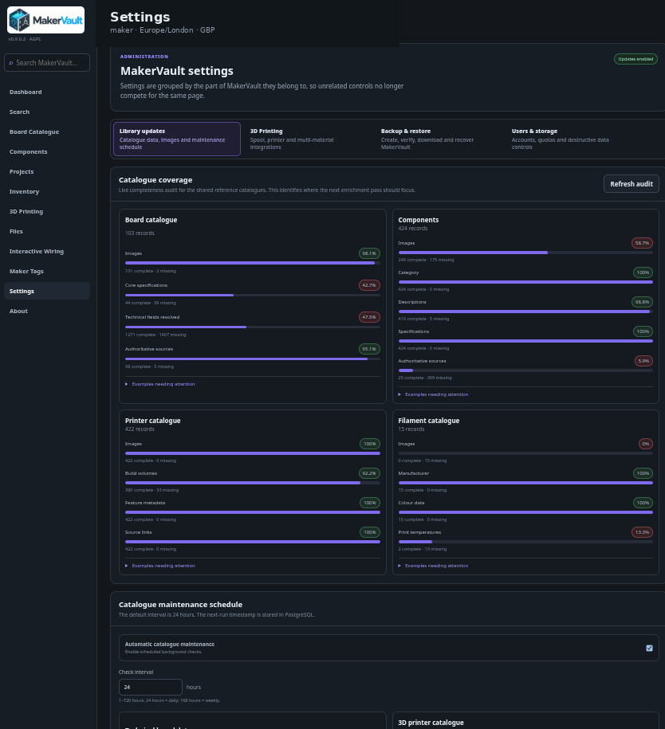

# Catalogue updates

**Goal:** keep reference data and images fresh without daily manual work.

1. Open **Settings → Library updates** as an administrator.
2. Review whether automatic maintenance is enabled.
3. Choose the interval; the default is **24 hours**.
4. Select the available technical board-data, printer-data and image checks you want.
5. Choose **Save schedule**.
6. Use **Run now** for an immediate queued check and review the last/next run information.

The schedule is stored in PostgreSQL and survives container rebuilds. Background workers perform the work, so queueing a run is not the same as completing it. External sources, retry intervals and per-run limits affect how quickly gaps are filled.

Enrichment is designed to preserve populated information rather than overwrite edits just because another source supplies a value. Unsupported models or unavailable reliable sources can remain incomplete indefinitely.

## Server-level controls

`.env` contains master switches such as `ENRICH_BOARD_CATALOGUE` and `SEED_CATALOGUE_IMAGES`. A UI schedule cannot override a server-level hard disable. Check those values if a category never runs.

If nothing runs, inspect the application logs and container health. Celery worker and Beat run inside the application container in this deployment; you do not need to create separate worker services for the standard Compose setup.

[Troubleshooting →](../reference/troubleshooting.md)

<figure markdown>
  
  <figcaption>Library updates report catalogue coverage and control scheduled maintenance.</figcaption>
</figure>
