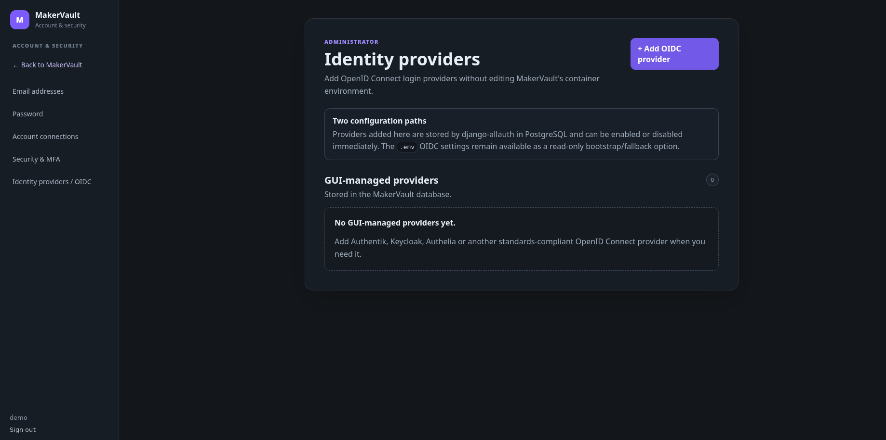

# OpenID Connect (OIDC)

**Advanced · Optional single sign-on**

OIDC lets users sign in through an identity provider you control or trust. MakerVault acts as the client. Local accounts remain useful for recovery if the provider is unavailable.

## Prerequisites

Finish normal installation and verify HTTPS first. Keep a working local superuser account and a separate browser session while testing. Obtain the issuer/server URL, client ID and client secret from your identity provider. Provider-specific screens differ; use its current OIDC client instructions.

## Register the client

Create a web application/client at the provider. Register the exact redirect URI:

```text
https://maker.example.com/accounts/oidc/oidc/login/callback/
```

The second `oidc` is the provider ID in this example. If your provider ID is `workshop`, use `/accounts/oidc/workshop/login/callback/`. Match the scheme, hostname, path and trailing slash. Do not use a wildcard callback.

Configure the provider to supply the normal OpenID identity information required by your account setup. Restrict which users can access this application at the provider before allowing automatic account creation.

## Configure MakerVault

Administrators can add database-backed providers from **Settings → Security → OIDC identity providers**. Use the provider's form for name/ID, server URL and client credentials. Alternatively, use these environment settings for server-managed bootstrap:

```dotenv
OIDC_ENABLED=true
OIDC_PROVIDER_ID=oidc
OIDC_PROVIDER_NAME=Workshop sign-in
OIDC_SERVER_URL=https://identity.example.com/YOUR-ISSUER-PATH
OIDC_CLIENT_ID=YOUR-CLIENT-ID
OIDC_CLIENT_SECRET=YOUR-CLIENT-SECRET
OIDC_FETCH_USERINFO=true
OIDC_PKCE=true
OIDC_AUTO_SIGNUP=true
OIDC_ALLOW_INSECURE_ISSUERS=false
```

Use the actual issuer/server URL required by the provider; the placeholder is not a working endpoint. Apply environment changes with `sudo docker compose up -d`. Avoid defining the same provider twice through both management methods.

`OIDC_AUTO_SIGNUP` permits account provisioning for an accepted provider identity; it is separate from local registration. Decide whether this is appropriate for your installation. Do not assume a matching email address guarantees safe account linking or that provider group membership automatically maps to MakerVault permissions.

## Test the complete path

Use a separate private browser window. Select the provider, authenticate and confirm the resulting MakerVault username. Verify its editing rights, private workspace and quota. Assign the needed local group/permissions deliberately. Sign out and test sign-in again before asking others to rely on it.

If authentication fails, check the exact redirect URI, issuer, client credentials, HTTPS/proxy settings and both services' error messages. Keep client secrets and login tokens out of shared logs. If the provider is unavailable, use your retained local administrator account to recover configuration.


<figure markdown>
  
  <figcaption>OIDC providers can be managed in the application as well as bootstrapped from environment settings.</figcaption>
</figure>
