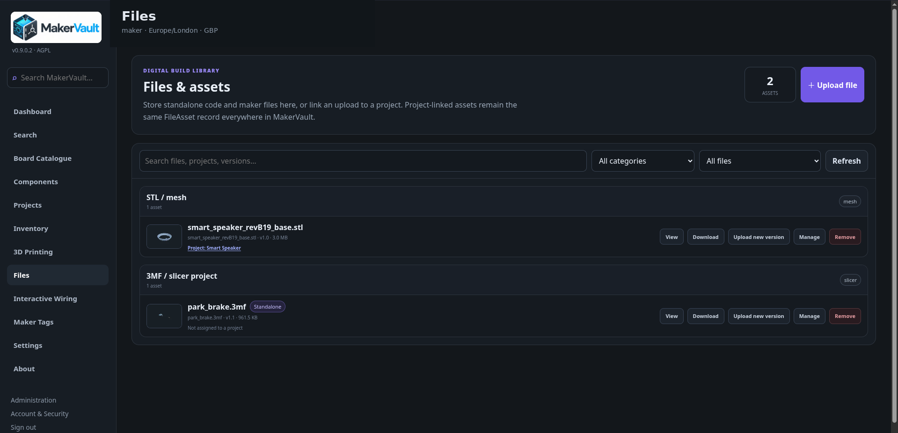
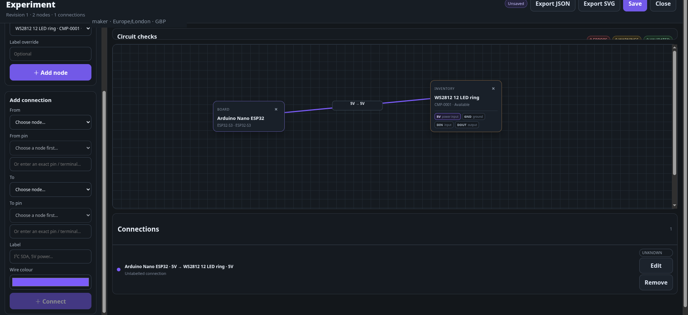

# Your first MakerVault workflow

**Goal:** learn how the main parts of MakerVault fit together by taking one small project from catalogue lookup to physical inventory, BOM planning, files, wiring, a printable model and an optional Maker Tag.

You do not need to use every feature in one sitting. Complete the core path first, then stop at any optional section that does not match your workshop.

!!! tip "Use real data where possible"
    If MakerVault already contains your real stock, use a board or component you actually own. If you are only exploring the interface, choose a harmless example and avoid inventing quantities in an inventory you rely on.

## What you will build

For this walkthrough, imagine a small **desk sensor enclosure** built around a development board. By the end, MakerVault will contain:

- a catalogue record describing the board;
- an inventory record for the units you own;
- a project and bill of materials;
- an allocation reserving one physical board for the build;
- a project file or repository link;
- optionally, a wiring diagram;
- optionally, an STL/3MF model and print record;
- optionally, a Maker Tag linking the physical object back to MakerVault.

The important idea is that these are **different kinds of records**. MakerVault keeps reference data, physical stock, project planning and digital assets separate so each can have its own history.

## 1. Find the board in the catalogue

Open **Board Catalogue** and search for the board you want to use.

Open its details and check the exact model/variant. Review any available technical information such as operating voltage, interfaces and compatibility. A blank field means MakerVault does not currently know the value; it does not necessarily mean the feature is unsupported.

<figure markdown>
  
  <figcaption>The catalogue describes what a product is; it does not yet say that you own one.</figcaption>
</figure>

If the correct product is missing, add a suitable catalogue record if your account has permission. Avoid renaming a different board just to make the project fit.

**You have completed this step when:** the exact board or component you intend to use has a suitable catalogue record.

[More about boards and components →](../using/catalogue.md)

## 2. Record the physical item you own

From the board detail, use the inventory action, or open **Inventory → Add item**.

Enter the quantity you physically own, its condition/status and a real storage location such as `Cabinet 1 / Drawer A2`. Leave the inventory ID blank unless you have a reason to supply your own identifier.

<figure markdown>
  
  <figcaption>Inventory records represent physical stock you own, including its location and availability.</figcaption>
</figure>

If two otherwise identical items need different locations, histories or conditions, use separate inventory records rather than one combined quantity.

**Example:** record two identical development boards. MakerVault should show a total quantity of two and, initially, two free/unallocated units.

**You have completed this step when:** you can reopen the inventory record and the quantity, status and location match the physical items in front of you.

[More about physical inventory →](../using/inventory.md)

## 3. Create a project

Open **Projects → New project** and create:

**Name:** `Desk sensor enclosure`

Add a short summary explaining what you intend to build. Save the project, then reopen its workspace.

<figure markdown>
  
  <figcaption>A project becomes the home for planning, notes, files, stock reservations and related printed parts.</figcaption>
</figure>

Add useful build notes rather than a diary. Examples include:

- intended power source;
- chosen communication method;
- enclosure constraints;
- firmware decisions;
- anything you are likely to forget before the next work session.

**You have completed this step when:** the project appears in the Projects page and opens into its own workspace.

[More about projects →](../using/projects.md)

## 4. Add the bill of materials

In the project's **Bill of materials**, add a requirement for one development board.

Set the required quantity to `1`. Add another component or a simple custom item such as mounting screws so you can see the difference between catalogue-backed and custom BOM entries.

<figure markdown>
  
  <figcaption>BOM entries describe what the project needs; they are not themselves physical stock.</figcaption>
</figure>

A custom BOM entry is useful for parts that do not need a reusable catalogue definition. It does not automatically create an inventory item.

**You have completed this step when:** the BOM clearly describes the parts the build requires.

## 5. Reserve one of your boards for the project

Use the BOM allocation controls to reserve `1` board from the inventory record created earlier.

With two boards in stock and one reserved, the expected state is:

| Measure | Expected value |
| --- | ---: |
| Total stock | 2 |
| Allocated to this project | 1 |
| Free / unallocated | 1 |

Allocation is a **reservation**, not a stock deduction. MakerVault keeps the physical total at two until you deliberately change the inventory record.

This distinction matters when several projects compete for the same parts: BOM allocations tell you what is already committed before you physically assemble anything.

**You have completed this step when:** the BOM shows coverage from inventory and the inventory record shows one unit still free.

## 6. Add a project file

Upload something useful with **＋ File**. Good first examples are:

- a wiring sketch;
- a PDF datasheet;
- assembly notes;
- firmware configuration;
- CAD source;
- an STL/3MF model.

<figure markdown>
  
  <figcaption>Files can live independently or be linked back to a project.</figcaption>
</figure>

If the firmware is maintained in Git, add the repository URL with **＋ Repository**. MakerVault stores the link and context; it does not clone or back up the remote repository.

When the file changes later, use **Upload new version** rather than creating a second unrelated file record. Check version history to confirm the previous revision remains available.

**You have completed this step when:** the file is visible in the project and can be opened or downloaded again.

[More about files and versions →](../using/files.md)

## 7. Optional: document the wiring

If the project contains electronics, open **Interactive Wiring** from the project or the standalone Wiring Lab.

Add the development board and another node, then create at least one pin-to-pin connection. Give the connection a useful label.

<figure markdown>
  
  <figcaption>Interactive Wiring records the intended connections and can flag some obvious conflicts where enough pin metadata is available.</figcaption>
</figure>

Treat the circuit checks as assistance, not electrical approval. Verify voltages, polarity, current limits and component datasheets yourself.

**You have completed this step when:** the diagram can be saved and reopened with the expected nodes and connections.

[More about Interactive Wiring →](../using/interactive-wiring.md)

## 8. Optional: add a printable enclosure

Open **3D Printing → Model Library** and add the enclosure model. Link it to this project and upload an STL or 3MF.

Open **View** and inspect the geometry.

<figure markdown>
  
  <figcaption>The viewer helps inspect a stored model; your slicer remains responsible for actual print preparation.</figcaption>
</figure>

Check dimensions and, where available, printer fit. MakerVault's geometry analysis is useful context, but it does not replace slicing or mesh repair.

If you later change the design, create or upload the next revision rather than overwriting the history.

**You have completed this step when:** the model is linked to the project and its current revision opens in the viewer.

[More about models and revisions →](../using/models.md)

## 9. Optional: record the print and retain the physical part

Prepare and run the print in your normal slicer/printer workflow. MakerVault can record print history independently of whether you keep the resulting object as a managed part.

After a successful print, use **Create printed parts** if you want the physical enclosure to remain in MakerVault as an object you can locate, install, replace or tag.

<figure markdown>
  
  <figcaption>Printed parts are created explicitly; MakerVault does not automatically turn every successful print into retained inventory.</figcaption>
</figure>

This separation is intentional: test prints and failed prints can remain in history without cluttering the list of physical objects you actually keep.

[More about printed parts →](../using/printed-parts.md)

## 10. Optional: attach a Maker Tag

If you want to identify the board, enclosure, spool or other supported physical record by scanning it, open **Maker Tags**.

Create a tag for the physical record and use a QR, NFC or RFID identity appropriate to your hardware.

<figure markdown>
  
  <figcaption>A Maker Tag links a physical identifier to an existing MakerVault record.</figcaption>
</figure>

The tag is an identifier, not an authentication secret. Do not store passwords, API keys or other credentials on it.

**You have completed this step when:** scanning or entering the tag identity resolves to the correct MakerVault record.

[More about Maker Tags →](../using/maker-tags.md)

## 11. Check the finished project

Return to the project and confirm that the parts of the workflow you used are connected correctly:

- the project exists and has useful notes;
- the BOM says what the build needs;
- allocated inventory reflects what is reserved;
- uploaded files open from the project;
- wiring is saved if you created a diagram;
- the model/revision is linked if you added one;
- printed parts exist only for physical objects you chose to retain;
- Maker Tags resolve to the correct physical record.

The project should now function as the **context** for the build without collapsing everything into one record. The catalogue still describes products, inventory still represents physical stock, Files still owns digital assets, and the project ties the relevant pieces together.

## Where to go next

If this workflow made sense, you are ready to start entering real workshop data. A good order is:

1. add the boards/components you use most often;
2. record physical inventory and locations;
3. create active projects and their BOMs;
4. attach the files you would otherwise have to hunt for later;
5. add printer/spool integrations only when you need them;
6. configure backups before the installation becomes important to you.

For a new self-hosted installation, make **Back up and restore** your next administrative chapter.

[Back up and restore →](../administration/backup.md)
