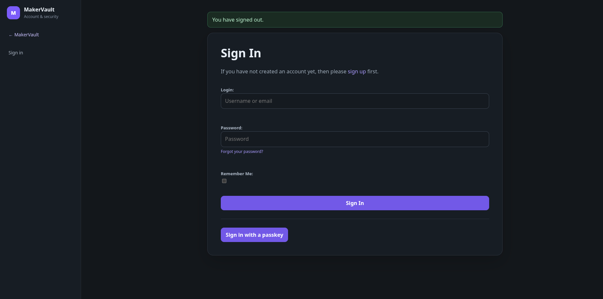
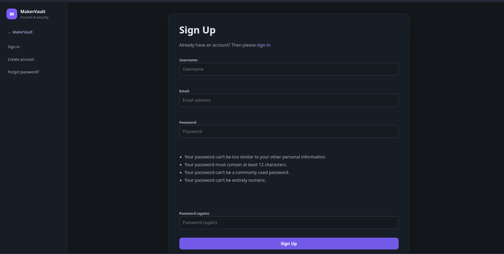
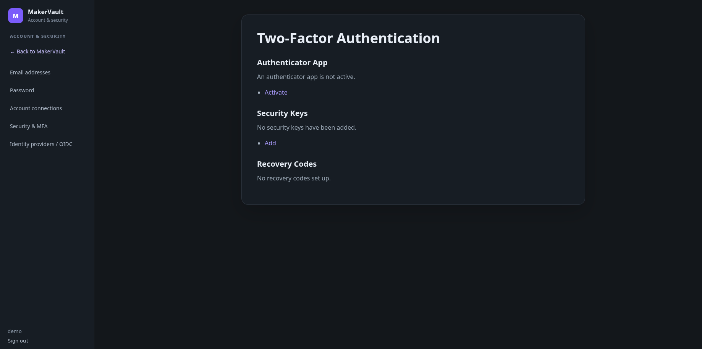
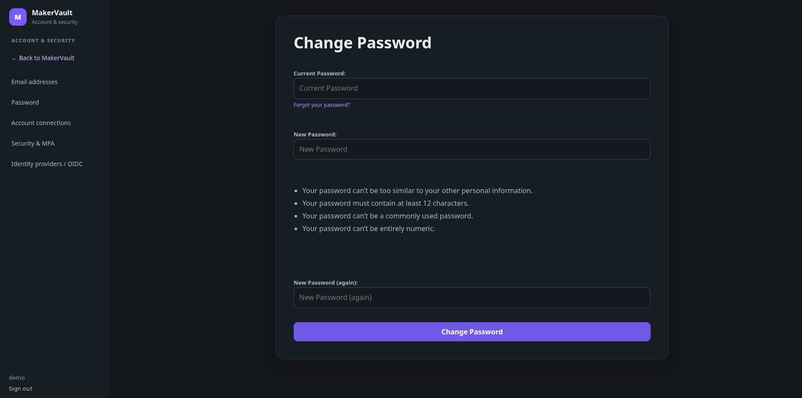

# First sign-in

**Goal:** check your account and make the application ready for everyday use.

## First administrator on a new installation (planned v1.0.5)

When **no administrator exists**, visiting MakerVault's normal web address automatically opens the first-run setup wizard. The operator must first obtain a one-time token from the server; a visitor cannot claim the administrator account without it. The token is valid for 30 minutes.

From the installation directory on the Docker host, run:

```bash
sudo docker compose exec -u makervault makervault python manage.py first_run_token
```

If your installation uses a custom Compose project name or multiple files, include the same `-p` and `-f` options you used when starting MakerVault. **Do not share the token or include it in screenshots.** Enter it in the browser wizard, then create the administrator with a username, email address, password and matching confirmation. Use **Show passwords** to inspect both entries before submitting.

To use the wizard, leave `MAKERVAULT_ADMIN_PASSWORD` empty in `.env`; otherwise startup can create the administrator automatically. The original terminal-based `createsuperuser` command remains an alternative. After an administrator exists, the wizard is closed and MakerVault uses its normal sign-in process. Forgot or mistyped the password? See [administrator password recovery](../administration/accounts.md#recover-an-administrator-password-from-the-server); do not reinstall or delete your database.

This flow is currently in application PR #80 and is **not present in the published v1.0.4 container**.

## Sign in

Open the address supplied by your administrator. If you installed MakerVault yourself, use the superuser account created during installation.

<figure markdown>
  
  <figcaption>Sign in with your local account, or use a configured passkey or identity provider where available.</figcaption>
</figure>

If your administrator has enabled local self-registration, choose **Create account** / **Sign up**, enter a username, email address and password, then follow any email-verification instructions for the installation. If self-registration is disabled, the administrator must create or provision your account instead.

<figure markdown>
  
  <figcaption>The Sign Up page appears when local self-registration is enabled.</figcaption>
</figure>

## Check the basics

1. Check the username, timezone and currency in the page header. The displayed currency is not an automatic currency-conversion service.
2. Open **Board Catalogue** and **Components**. Starter records should be present. Missing images do not mean installation failed: image discovery is a separate background task.
3. If you are an administrator, open **Settings → Library updates** and review the maintenance schedule. Save any changes.
4. Create a small example project using the next chapter before importing a large collection.

## Secure your account

For the upcoming v1.0.5 interface, open **Settings → User Account** to review password, email, two-factor authentication and Connected accounts. Existing v1.0.4 installations continue using **Account & Security**.

An authenticator app adds a second sign-in step. Security keys can provide another strong factor, and recovery codes give you a way back into the account if the normal second factor is unavailable. Store recovery codes somewhere safe before depending on MFA.

<figure markdown>
  
  <figcaption>MFA, security keys and recovery codes are managed in the account security workflow, reached from Settings → User Account in the planned v1.0.5 interface.</figcaption>
</figure>

For a local account, use **Password** in Account & Security when you need to change the password. Passkey availability depends on a suitable secure browser origin, normally HTTPS.

<figure markdown>
  
  <figcaption>Local-account passwords can be changed without involving an administrator.</figcaption>
</figure>

## Missing buttons or empty pages?

A new account does not automatically gain editing rights. An administrator can assign the **Editor** group. Viewer accounts can read the records available to their own account but cannot create or edit them. The Settings menu is shown to staff, and **Users & storage** requires a superuser.

Private inventory, projects, files, printers and spools belong to their creator. Signing in with a second account normally gives you a separate workspace, even when the shared catalogues contain the same products.

## Things you can leave until later

You do not need Spoolman, SimplyPrint, a printer connection, OIDC or a reverse proxy to begin organising your own local workshop. Add integrations only when there is existing data or equipment you want to connect.

**Next:** [Follow the guided newcomer workflow](first-project.md).
