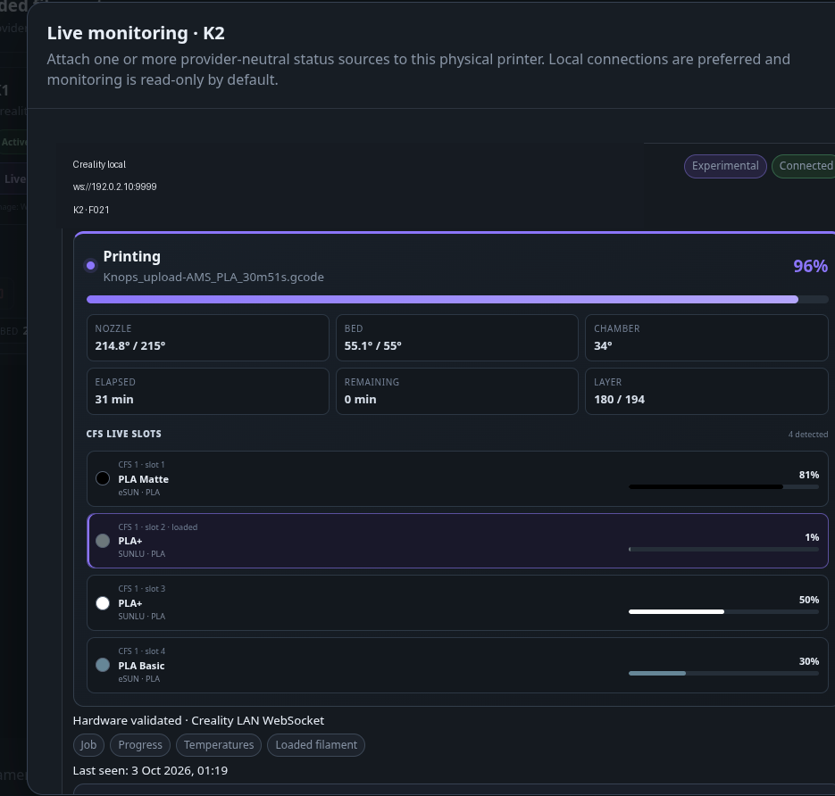

# Creality local monitoring and CFS

**Optional · Local-first · Read-only by default; optional controls from v0.7.3.2**

MakerVault has two complementary Creality integrations:

- **Creality local live monitoring** reads printer telemetry over the LAN WebSocket used by Creality Print.
- **Creality CFS** reads CFS boxes and filament slots and maps them into MakerVault's provider-neutral slot inventory.

Neither path requires a Creality Cloud login. Compatibility still depends on the printer model and firmware exposing the local interface.

## Live printer monitoring

1. Add or edit the owned printer in **3D Printing** and enter its local host/IP, for example `192.168.1.34`.
2. Open the printer card and choose **Live monitor**.
3. Select **Creality local**. On Creality printers MakerVault prefers this adapter and pre-fills the host/IP already stored on the printer.
4. Add the source, then choose **Refresh** for the first connection test.
5. Once connected, MakerVault can display the fields the printer reports, including print state, filename, progress, elapsed/remaining time, layer counts, nozzle/bed/chamber temperatures, errors and whether CFS is present.
6. Scheduled polling then follows the connection's configured interval.

The current adapter uses the local Creality WebSocket service on port 9999. Monitoring has owner confirmation on K2 and K1; K1 monitoring was also tested through Moonraker. Other models and firmware remain experimental. Optional Pause, Resume and confirmed Cancel are available from v0.7.3.2 and require a per-source opt-in. Controls still need K2 hardware testing. See [Optional printer controls](printer-controls.md). Heater, movement and raw G-code controls are not exposed.

## CFS set up

1. Add your owned printer in **3D Printing** using the correct model.
2. Open **Manage printer** and confirm that CFS hardware is actually installed, not merely supported by the model.
3. Enter the printer's reachable local host/IP and save.
4. Open **Settings → 3D Printing**, enable Creality CFS and save.
5. Choose **Sync now**. Check the integration status and the printer's discovered slots.
6. Enable scheduled sync only after manual sync works.

The summary distinguishes compatible, installed and configured printers. If these counts differ, correct the owned-printer record before troubleshooting the network.

## Identify a detected reel

A slot can report colour/material without identifying which physical reel you own. Choose its **Add to inventory** action, then link an existing unloaded spool or create a new physical spool. Review weight, status and product information before confirming.

This confirmation avoids producing duplicate inventory whenever a printer reports a filament assignment. Moving a reel between slots does not mean you purchased another reel.

## If telemetry or slots do not appear

Confirm that the printer is on, the host/IP has not changed, and MakerVault can reach the printer across your network/VLAN rules. For live monitoring, port 9999 must be reachable. For CFS, confirm the CFS is physically connected and enabled on the owned-printer record.

Review the specific live-source or integration error. A printer catalogue entry alone does not establish compatibility, and firmware updates may change undocumented local telemetry behaviour.

## Camera feeds

K1 and K2 camera playback have owner confirmation. Camera setup is a separate action on the printer card; the configured preview appears automatically on visible dashboard and 3D Printing cards. K1 uses supported HTTP image/MJPEG routes, while K2 can use experimental Creality WebRTC. See [camera setup and network requirements](printer-cameras.md); playback confirmation does not establish every route, firmware or browser combination.

<figure markdown>
  
  <figcaption>Creality local monitoring can expose job, temperature and CFS context.</figcaption>
</figure>
