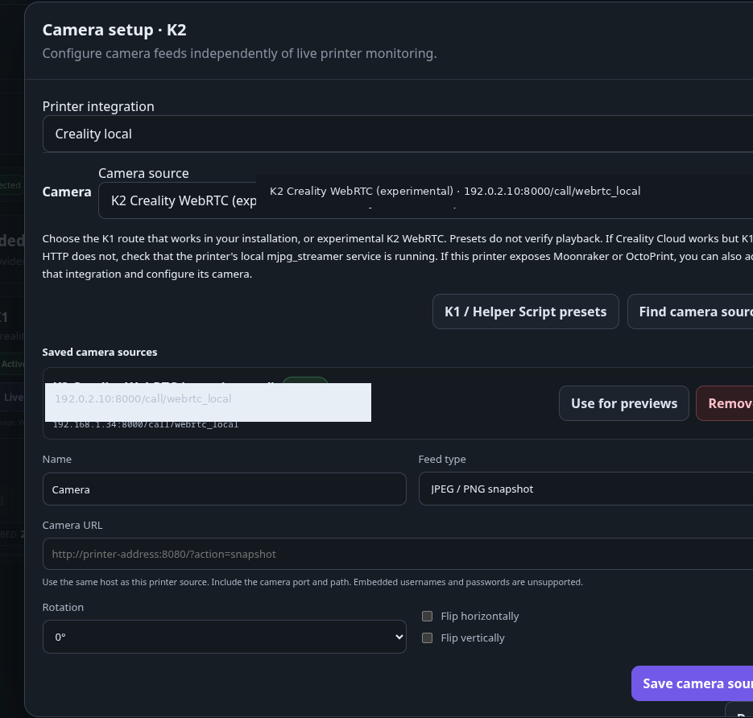
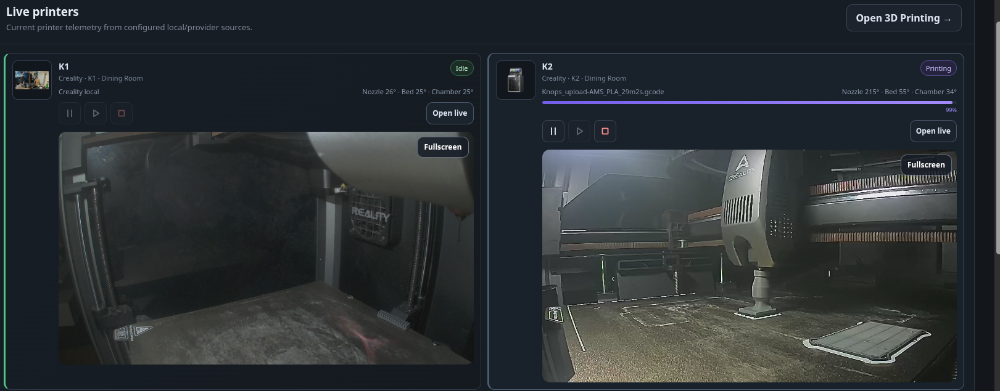

# Printer camera feeds

Configured camera feeds start automatically when their printer card is visible on the dashboard or 3D Printing page. Printer monitoring, print history and filament accounting continue independently of the viewer.

## Set up a feed

1. Open **3D Printing** and find the printer card.
2. Choose **Camera setup** alongside Manage printer. Setup is separate from **Open live**, which shows printer telemetry, and requires edit permission. Select the integration whose camera you want to configure.
3. Select **Find camera sources**. Moonraker reads its webcam configuration; OctoPrint reads its classic webcam settings (the integration API key needs Settings Read). Creality offers K1 and K2 presets; PrusaLink reads its local camera API where supported. Anycubic/FlashForge can reuse recognised HTTP camera URLs from their latest status. K1/K2 playback is owner-confirmed; other hardware and specific route combinations still need testing.
4. Choose a discovered source or enter its name, feed type and full URL manually. Use the same host as the live integration, including any required camera port/path.
5. Save and choose **Done**. The last camera saved becomes the automatic preview on both pages. To use an existing camera instead, select it inside Camera setup and choose **Use selected camera for previews**. A saved source is not proof of a working feed.

The embedded viewer shows the feed and a **Fullscreen** button, with no setup, integration or feed selectors. On browsers without native image fullscreen, Fullscreen opens a page-filling viewer with a Close control. Setup remains a separate printer action.

After adding a live source, an optional second step offers **Add camera** or **Not now**. Choosing Not now leaves monitoring configured and closes the prompt. Camera setup remains available on the printer card.

You can configure up to eight sources per printer integration. Multiple visible printer cards can show their own feeds. Changing the configured preview, disabling its integration, scrolling the card off-screen, hiding the browser tab or leaving the page releases playback resources. Visible dashboard and 3D Printing cards fetch camera media automatically. Camera setup and Open live telemetry are separate; the printing-page previews pause while those dialogs are open. Camera discovery runs only when requested.

## Creality K1

The shared K1 troubleshooting session confirmed the direct port-8080 MJPEG route worked after starting `mjpg_streamer`, and then appeared in Fluidd. MakerVault uses the integration host rather than a hard-coded address. The owner subsequently confirmed K1 and K2 playback in MakerVault; route-specific regression checks remain on the hardware checklist.

For K1 systems exposing the local HTTP camera service, start with:

- MJPEG (the route confirmed in the shared troubleshooting session): `http://PRINTER_HOST:8080/?action=stream`
- Snapshot alternative: `http://PRINTER_HOST:8080/?action=snapshot`

**K1 / Helper Script presets** provides both snapshot and MJPEG choices for direct port 8080, Fluidd port 4408 and Mainsail port 4409. This also works in the Moonraker integration without requiring successful webcam discovery. No presets are probed or saved automatically.

Helper Script installations can alternatively expose `/webcam/?action=snapshot` or `/webcam/?action=stream` on Fluidd/Mainsail ports 4408/4409. Use the route working in your own installation. Moonraker discovery can pick up the configured camera URL and orientation. Camera playback was confirmed separately from printer monitoring.

If Creality Cloud works but these local URLs fail, the local `mjpg_streamer` service may be stopped even though `cam_app` is working. Starting it restored the feed in the shared troubleshooting session; reboot persistence was a separate follow-up. MakerVault does not install or restart printer services. Validate the feed again after reboot/firmware updates.

HTTP snapshot and MJPEG sources are shown as **refreshed live images**, approximately one image per second after each request completes. MJPEG sources yield one bounded JPEG frame per request. This first pass does not relay a continuous high-frame-rate MJPEG stream. It avoids holding a web worker for the lifetime of an open viewer.

## Creality K2 family — experimental WebRTC

Add the camera under the **Creality local** integration and choose the K2 preset:

`http://PRINTER_HOST:8000/call/webrtc_local`

MakerVault requests the printer's read-only video session token over its configured Creality WebSocket connection. Firmware advertising video encryption uses the token-protected signalling route on HTTP port 80; legacy firmware uses the configured port-8000 route. Tokens are kept on the server for negotiation and are not returned to the browser or saved in diagnostics.

The viewer negotiates video only and requires an H.264-capable WebRTC browser. It never requests access to your phone or computer's camera/microphone. Codec, ICE and firmware differences still require testing on each model/firmware; monitoring success is not playback validation.

**The browser must reach the printer's network, normally via LAN or VPN.** MakerVault proxies signalling, but does not relay WebRTC media and does not configure a TURN server. Accessing MakerVault remotely through HTTPS alone will not make the printer's video network reachable. Close other printer camera viewers if the printer permits only one session. Use Reconnect after a connection failure.

## Providers and extension framework

Discovery providers produce the same validated source contract: name, playback mode, URL, rotation and flips. Provider guidance, candidates and rejection reasons are separate from configured sources and hardware verification. Adding a provider reuses the existing permission checks, URL restrictions and playback lifecycle. A native transport needs its own implementation and tests; adding a registry entry alone does not make it playable.

| Integration | Discovery / native route | Current boundary |
| --- | --- | --- |
| Creality | K1 direct/Helper Script presets; K2 WebRTC signalling | Hardware/firmware testing pending |
| Moonraker / Klipper; Elegoo, QIDI, Sovol, Snapmaker, Voron profiles | Moonraker webcam configuration | HTTP snapshots/MJPEG only; Klipper needs an external camera service |
| OctoPrint | Default webcam settings, including orientation | Falls back to usable stream when the configured snapshot is localhost; does not fetch MakerVault localhost |
| Prusa | PrusaLink `GET /api/v1/cameras`, then `GET /api/v1/cameras/{camera_id}/snap` | Experimental; only PrusaLink versions exposing this API; API-key authentication; reads latest stored image, does not trigger captures or import Connect cloud cameras |
| Anycubic / FlashForge | Recognised HTTP image/MJPEG URL from latest manufacturer telemetry | No camera URL refresh until printer monitoring updates; unknown formats, RTSP, other hosts and embedded credentials are rejected with guidance |
| Bambu Lab | Manual same-host HTTP source if separately available | Native Bambu camera transport/relay not implemented |
| SimplyPrint | Manual local feed; alternative local integration where supported | Cloud camera access not implemented |
| Other | Manual HTTP source | No guessed manufacturer endpoints |

For printers exposing Moonraker or OctoPrint alongside a manufacturer interface, add that live integration to the same printer and set up its camera there. Camera viewing does not require enabling printer controls. The owner confirmed K1 and K2 camera playback and accepted the compact automatic preview layout on 2 October 2026. Exact source route, firmware and browser were not supplied with that confirmation. Other manufacturers and remaining lifecycle/security checks remain pending in issue #37.

## Security and troubleshooting

HTTP images use authenticated, owner-scoped MakerVault routes, so HTTP printer cameras can be viewed from an HTTPS MakerVault deployment without mixed-content image requests. Source URLs, query tokens and camera session tokens are excluded from ordinary connection summaries and copied diagnostics. Owners with edit permission can inspect the URLs in camera setup.

Camera requests stay on the configured printer host. Loopback, link-local, unspecified, multicast and reserved IP targets are rejected; DNS is resolved and pinned before connecting. Redirects are rejected. HTTPS certificates are verified. Existing API keys accompany only requests to the original API origin, never a different camera port. Embedded URL credentials and separate camera Basic/Digest login are not supported in this first pass.

Responses have byte, image-dimension and network timeout limits. A per-user request guard prevents overlapping camera proxy work; media requests from multiple visible feeds are queued in the browser tab. Failed image requests retry twice and then stop until Reconnect is selected. Responses are private and not cached. Changing a camera hostname may require updating its integration hostname first.

If discovery is empty, configure the exact snapshot/MJPEG URL manually. Unsupported HLS, RTSP and generic WebRTC sources are not treated as MJPEG. Separate camera hosts, cloud feeds and media relay/transcoding remain follow-up work. Unsupported camera interfaces remain unavailable even if telemetry reports camera hardware.

## Hardware checklist

- Test all three K1 direct/Fluidd/Mainsail routes through Creality and Moonraker; test K2 WebRTC independently and record firmware/browser.
- Confirm an image or video actually appears, and verify orientation and fullscreen at desktop and mobile sizes.
- Scroll previews off-screen/on-screen, hide/show the tab, change the configured camera and leave the page; verify playback is released and printer monitoring continues.
- Test printer offline/reconnect and camera authentication errors.
- Test HTTP feeds through the HTTPS reverse proxy. Test K2 on LAN/VPN; do not claim remote media relay support.
- Test PrusaLink API-key snapshot access and freshness; Anycubic/FlashForge reported HTTP sources and unsupported-format guidance; each Moonraker profile and OctoPrint orientation/fallback. Record model, firmware, route and browser.
- Confirm a different MakerVault account cannot list or view the source.

Protocol references: [Moonraker webcams](https://moonraker.readthedocs.io/en/latest/external_api/webcams/), [PrusaLink camera API](https://github.com/prusa3d/Prusa-Link/blob/master/prusa/link/web/cameras.py), [OctoPrint settings](https://docs.octoprint.org/en/main/api/settings.html), [Creality Helper Script camera configuration](https://guilouz.github.io/Creality-Helper-Script-Wiki/configurations/configure-camera/), [go2rtc Creality signalling](https://github.com/AlexxIT/go2rtc/blob/master/internal/webrtc/client_creality.go), and [token-protected K2 protocol reference](https://github.com/geckotdf/Creality-K2-Camera-Fix).

<figure markdown>
  
  <figcaption>Camera configuration is kept separate from live monitoring.</figcaption>
</figure>

<figure markdown>
  
  <figcaption>Configured cameras can appear on visible printer and dashboard cards.</figcaption>
</figure>
