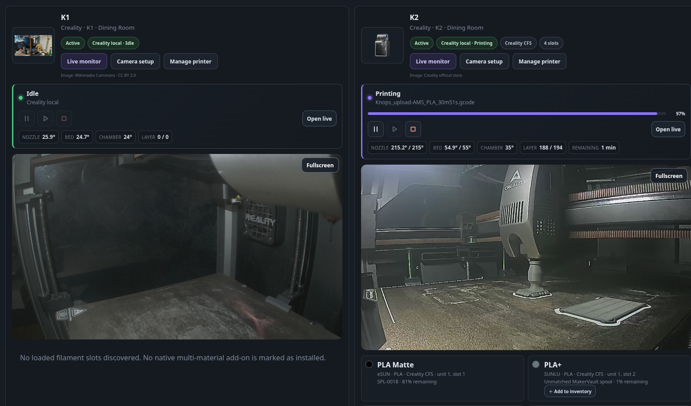

# Optional printer controls

MakerVault provides optional **Pause**, **Resume** and **Cancel print** actions for supported live sources. Controls are disabled by default on every existing and newly added source.

## Supported sources

| Source | Current controls | Hardware validation |
| --- | --- | --- |
| Creality local | Pause, Resume, Cancel over the local WebSocket | K1/K2 monitoring confirmed; controls awaiting hardware testing |
| Moonraker / Klipper | Pause, Resume, Cancel through job API endpoints | Protocol tests; representative hardware testing required |
| Elegoo, QIDI, Sovol, Snapmaker U1, Voron profiles | Same controls where a compatible Moonraker API is exposed | Experimental by model/firmware |
| OctoPrint | Explicit Pause, Resume and Cancel through its job API | Protocol tests; hardware testing required |
| Bambu, PrusaLink, Anycubic, FlashForge, SimplyPrint | Monitoring only | See the adapter validation guide |

Upstream capability labels do not guarantee that MakerVault implements a control. Only the sources listed above expose the opt-in.

## Enable controls

1. Open your printer's **Live monitor**.
2. Refresh the source and check the printer name, current job and status.
3. Enable **Allow Pause, Resume and Cancel** on the source you want to use.
4. Use **Pause** while printing or **Resume** while paused.
5. **Cancel print…** asks you to confirm the printer and filename before stopping the print.

You must own the printer and have permission to edit printers. Viewer accounts cannot enable or send controls. Disable the checkbox to return the source to read-only monitoring.

After enabling a source, compact controls also appear beside the progress summary on the dashboard and 3D Printing page: two bars pause, the play triangle resumes a paused print, and the square cancels after confirmation. Unavailable actions are disabled. **Open live** on the dashboard opens that printer's live monitor directly.

Camera detection is separate from configured playback. Supported feeds appear automatically in dashboard/printer cards after separate camera setup; camera availability metadata alone is insufficient. See [camera feeds](printer-cameras.md).

## How state checks work

Actions require a connected source with an active named job and a status observed within the last 60 seconds. MakerVault refreshes the source again before sending the command. If the job or state changed, the request is rejected and you must refresh and confirm again. Power-loss recovery on Creality is handled from the printer itself.

MakerVault stores a command receipt before contacting the printer. Repeating the same request does not send another command. Recent commands temporarily block another action on the same physical printer, including requests through another source.

**Command sent** means the request was sent or accepted by the protocol. It does not mean the printer has finished pausing, resuming or stopping. The live state changes only when telemetry reports the change; Print History follows that telemetry too.

If delivery is uncertain, refresh and inspect the printer's actual state before another action. MakerVault does not automatically retry commands. Network and firmware delays still leave a short interval between the final status check and dispatch; this interface is not an emergency-stop system.

This pass does not expose Start print, movement, heating, macros or raw G-code.

## Testing still required

K2 control testing: use a small ordinary print, enable controls, check Pause and Resume, then confirm Cancel and verify the printer and Print History agree. Confirm disabled controls cannot be used. Other manufacturer hardware checks remain tracked in [hardware validation TODO #37](https://github.com/gavrd7/MakerVault/issues/37).

Protocol references: [Moonraker job controls](https://moonraker.readthedocs.io/en/latest/external_api/printer/#pause-a-print-job), [OctoPrint job operations](https://docs.octoprint.org/en/main/api/job.html), and Creality's local `Pause`, `Continue` and `Stop` implementation in [Creality Print](https://github.com/CrealityOfficial/CrealityPrint/blob/master/resources/web/deviceMgr/assets/BZCDzYbb.js). Creality command support remains experimental until hardware tested.

<figure markdown>
  
  <figcaption>Controls are source-specific and separate from monitoring support.</figcaption>
</figure>
