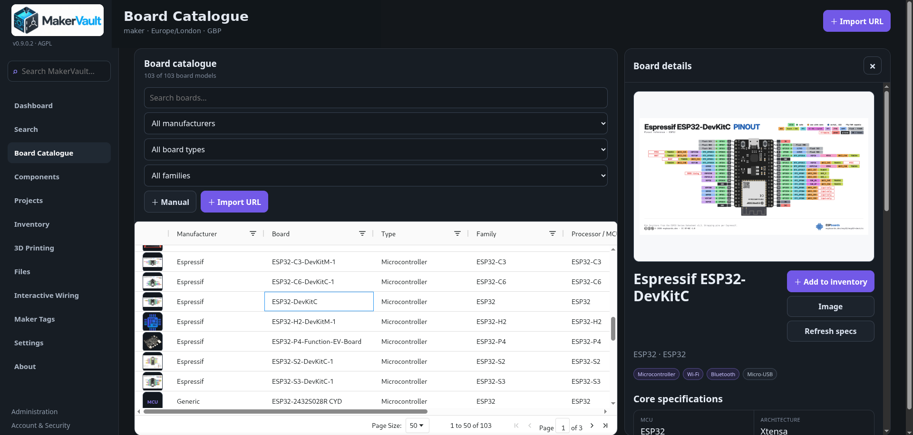
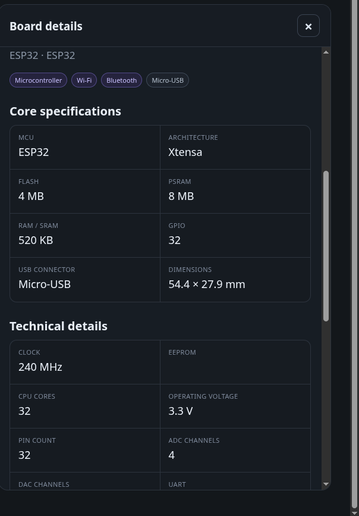
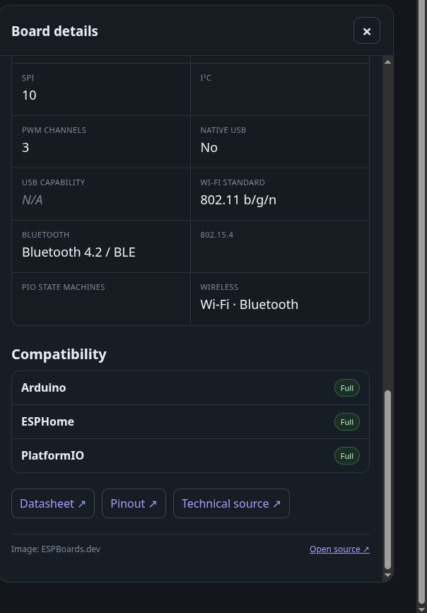
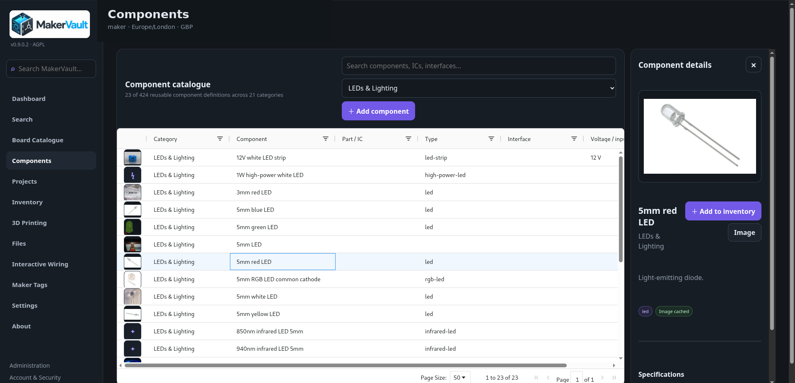

# Boards and components

**Goal:** find or create an accurate description of a product before recording the units you own.

<figure markdown>
  
  <figcaption>Board Catalogue and detail panel.</figcaption>
</figure>

<figure markdown>
  
  <figcaption>Structured board specifications.</figcaption>
</figure>

<figure markdown>
  
  <figcaption>Additional technical fields, compatibility and source links.</figcaption>
</figure>

<figure markdown>
  
  <figcaption>Components catalogue.</figcaption>
</figure>

## Find a board

1. Open **Board Catalogue** and search for the model or family.
2. Select a record and check its manufacturer, variant and technical fields.
3. Open the image to inspect it more closely, if one is available.
4. Use its inventory action to record physical stock.

Technical fields may include CPU, clock, memory, ADC/DAC, interfaces, PWM, pin count, voltage and native USB. Missing data remains unknown. Similar-looking boards may differ electrically; the catalogue is a reference, not a substitute for checking a board's own documentation before wiring it.

## Add or import a missing board

With suitable editing permissions, use the catalogue's add controls for a manual record. Search first to avoid duplicates.

**Import URL** supports approved ESPBoards.dev board URLs:

1. Open **Import URL** and paste a supported public board page URL.
2. Review the import preview and confirm the model.
3. Complete the import, then review the resulting record.

An existing match receives missing source details rather than an unnecessary duplicate. This is not a general importer for any shopping or manufacturer URL. An unsupported URL should be added as a reference on a manually created record where appropriate.

## Components

Open **Components** for sensors, displays, power modules, audio parts, controls, connectors and other maker hardware. Check type, interface, voltage and package/form factor. Generic components are intentionally manufacturer-neutral; there is no need to invent a brand for a resistor or LED.

A component definition does not increase your stock. Add a separate inventory record for the amount you bought and where you keep it.

## Images and automatic data

Authorised editors can upload JPEG, PNG or WebP images, supply a public HTTPS image URL, or replace/remove an image. MakerVault caches processed images locally. Private-network URLs are blocked for catalogue image imports; upload an image file if it is only available on your LAN.

Automatic enrichment tries supported sources and missing fields, preserves populated values, and may still leave gaps where reliable information is unavailable. Missing pictures may reflect licence restrictions or no confident match. A blank image is preferable to an incorrect one.

**About → Media attribution** shows retained source/licence information. The default automatic sources use open-licensed media. ESPBoards artwork is a separately enabled source with different terms.

[Configure catalogue updates →](../administration/catalogue-updates.md)
