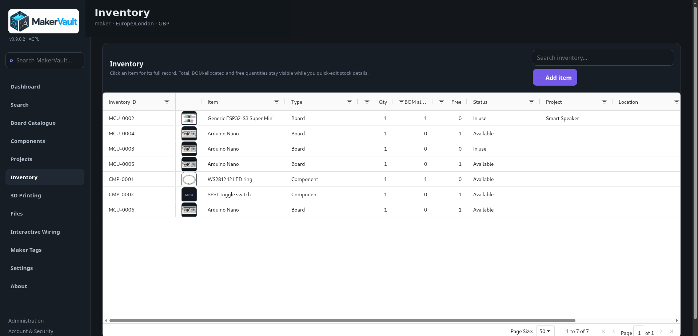

# Physical inventory

**Goal:** record the actual items you own and their location, condition and project commitments.

## Add an item

1. Open **Inventory → Add item**.
2. Choose the category and the matching board/component record where relevant.
3. Enter a quantity, status/condition and location.
4. Add supplier, purchase price, identifiers and notes if useful.
5. Leave the inventory ID blank for automatic generation and save.
6. Open the saved row and check the details.

Generated prefixes include `MCU` for boards, `CMP` for components, `AST` for tools/assets, `PRT` for printed parts and `OTH` for other items. You do not need to maintain a separate numbering spreadsheet.

A quantity row is useful for interchangeable parts stored together. Use separate records when items need distinct locations, condition, purchase details or individual tracking.

## Edit and move stock

Edit supported table cells directly or open the record and choose **Edit**. Change the location when you move it physically. Use a consistent location scheme such as `Cabinet 1 / Drawer B3`, rather than several spellings of the same drawer.

Lifecycle history records changes and the responsible user. Check it when a quantity, location, status or project assignment differs from what you expected.

## Understand reserved stock

| Quantity | Meaning |
| --- | --- |
| Total | Units recorded on the inventory item |
| Allocated | Units reserved against project BOM lines |
| Free / unallocated | Units available to allocate elsewhere |

Assigning an inventory item to a project and allocating a quantity to a BOM are related but different actions. A BOM allocation records the precise amount reserved for a requirement. Use it when you need stock coverage across builds.

MakerVault blocks over-allocation, quantity reductions below existing allocations and incompatible status/project changes. Resolve the allocation before changing the underlying inventory record.

## Release or delete

Open the record and use **Release from allocation** when available. Choose the specific project/BOM allocation to release; this does not delete the stock.

To delete an inventory row, release all BOM allocations first and use **Delete** if your account has that permission. Deletion removes the record; use a suitable lifecycle status instead when you want to retain a history of a retired or unavailable item.

[Projects and BOMs →](projects.md)

<figure markdown>
  
  <figcaption>Physical inventory keeps owned items separate from shared catalogue definitions.</figcaption>
</figure>
