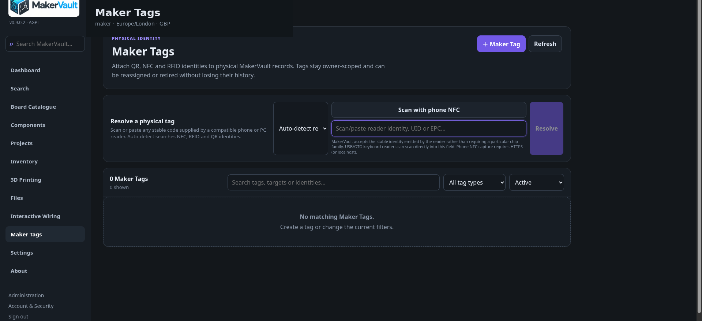

# Maker Tags

**Goal:** give a physical MakerVault record a scannable identity so you can get back to it quickly.

<figure markdown>
  
  <figcaption>Maker Tags can resolve QR, NFC and RFID identities to physical MakerVault records.</figcaption>
</figure>

Maker Tags attach a stable physical identity to an owner-scoped record. They are useful when a board, component, printed part, spool or other supported item is easier to scan than to search for manually.

## Create a tag

1. Open **Maker Tags** and choose **＋ Maker Tag**.
2. Choose the physical record the tag should identify.
3. Select the appropriate tag/identity type and enter or scan the stable identity.
4. Save the tag and, for QR workflows, print the generated label where appropriate.

A tag identifies an existing MakerVault record; it does not replace the inventory ID or create a new physical item by itself.

## Resolve a tag

Use the resolver at the top of the Maker Tags page. MakerVault can auto-detect supported NFC, RFID and QR identities where the reader supplies a stable value.

USB/OTG keyboard-style readers can usually scan directly into the identity field. Phone NFC capture requires a secure browser context, normally HTTPS (or localhost), because browser NFC APIs are not exposed to arbitrary insecure pages.

## Reassign or retire

A physical label or tag can outlive the object it was first attached to. Reassign or retire it deliberately rather than silently creating a second identity for the same tag. MakerVault retains the tag history so changes remain understandable later.

Do not put secrets on a Maker Tag. Treat the QR/NFC/RFID value as an identifier, not as an authentication credential.
