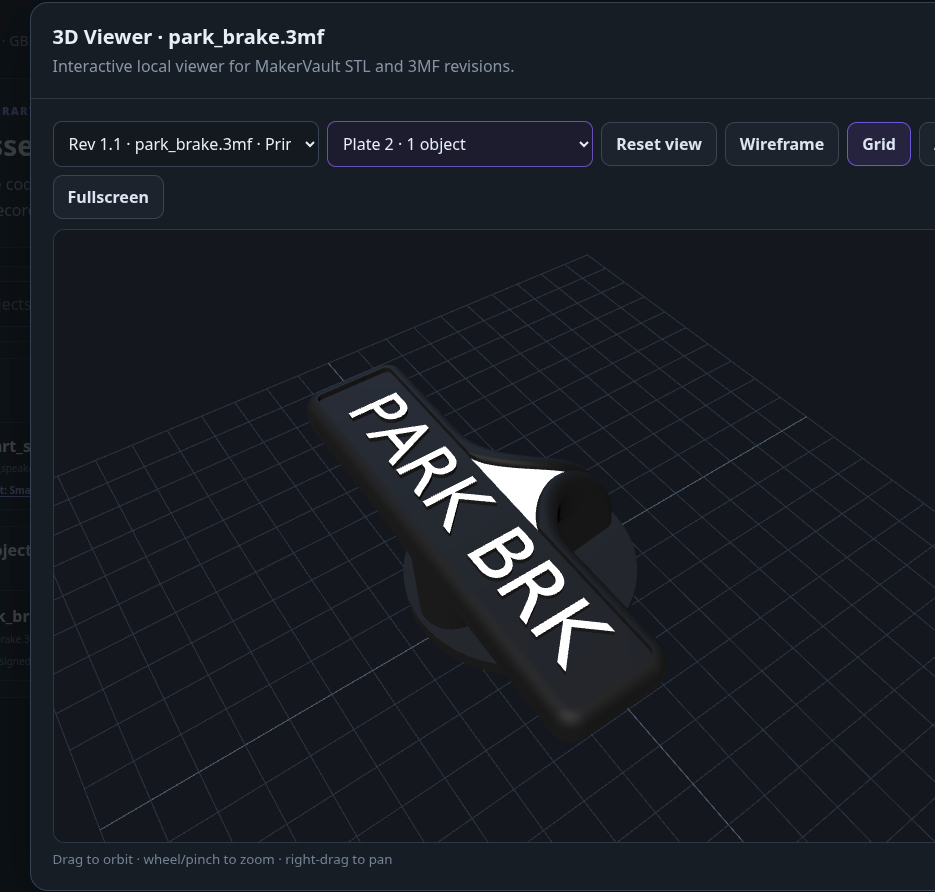

# Models and the 3D viewer

**Goal:** keep the history of a design and inspect printable geometry before opening your slicer.

## Add a model

1. Open the Model Library in **3D Printing** and choose the add-model action.
2. Enter the model name and optionally choose a project.
3. Upload an STL/3MF directly, or create the record and attach an existing file later.
4. Open the model to inspect its revision and linked assets.

A model is the design's record. A model revision identifies a particular iteration. A file is the stored digital asset. This separation lets a revision retain its printable mesh, slicer project and CAD source together.

## Revisions and assets

In **Manage model**, add a revision and attach a compatible existing file. Choose the asset's role: printable model, slicer project, CAD/source, reference or other.

Use **Upload new version** when replacing the design with a new iteration. This creates a new immutable model revision and preserves the previous STL/3MF on its earlier revision. Attaching/detaching a file link does not duplicate or delete the underlying stored asset.

## Inspect the geometry

Open **View** from the model, Files or Project where supported. Orbit, zoom and pan to examine the model. Reset returns to the initial view; grid, axes, wireframe and fullscreen aid inspection. STL/3MF previews are supported; a CAD source file is not necessarily directly renderable.

The Model Intelligence panel can show dimensions, triangle/vertex counts, surface area, approximate volume, units and mesh-health findings. Printer-fit checks use the owned printer's recorded build volume. Incorrect or missing printer dimensions make that comparison unreliable.

## Understand the limits

- Open edges or non-manifold geometry may need repair in a modelling tool or slicer.
- Approximate volume may be misleading for incomplete or invalid meshes.
- STL files do not reliably encode units; verify the interpreted dimensions before printing.
- Orientation guidance compares six axis-aligned candidates and estimates support risk, contact area and height. It does not test every possible rotation.
- Fitting inside a build volume does not prove the sliced job clears clips, exclusion zones, supports or a brim.

MakerVault analyses geometry locally and does not slice or repair the model. Confirm scale, orientation, support and machine settings in your slicer.

## Saved 3MF settings

Compatible 3MF packages may contain printer/process/filament profiles, layer height, nozzle, infill, wall counts, supports and brim settings. MakerVault reads available saved metadata; it does not calculate missing settings or ensure they match your printer now. Not every 3MF contains the same fields.

Re-analyse existing files when new analysis fields become available, using the analysis action where offered. A saved file remains useful even when analysis has limited information.

<figure markdown>
  
  <figcaption>The local STL/3MF viewer.</figcaption>
</figure>
