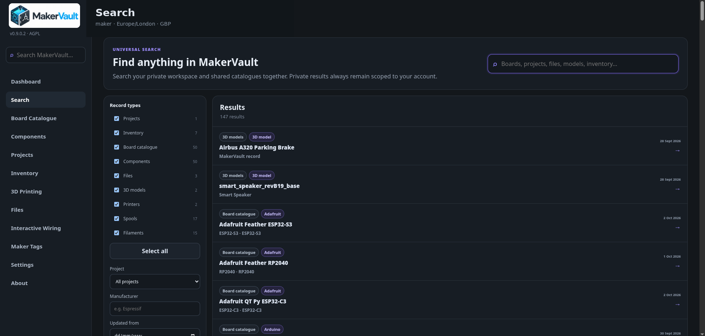

# Find your way around

| Area | Use it for |
| --- | --- |
| Dashboard | Workspace/storage summaries, live printer status and compact camera feeds |
| Search | Universal search and filtered results with direct navigation to records |
| Maker Tags | QR/NFC/RFID identities, printable labels and record resolution |
| Interactive Wiring | Project or standalone board/component wiring diagrams |
| Inventory | The physical boards, components, tools and other assets you own |
| Board Catalogue | Shared board descriptions and technical specifications |
| Components | Shared descriptions of generic maker components |
| Projects | Build notes, BOMs, allocated stock, files and repository links |
| 3D Printing | Printers, cameras, filament products, spools, models, print records and retained printed parts |
| Files | Uploaded assets, including files with no project |
| Settings | Administrative schedules, integrations and account/storage controls, according to permissions |
| About | Version, application information and media attribution |

The lower navigation area links to **Administration**, **Account & Security** and **Sign out**. Administration opens Django's management interface and requires suitable permissions; ordinary workshop tasks use the main application.

## Tables and detail views

Use the page's search and filter controls to narrow a list. Select a record to open its full details. In Inventory, supported cells can be edited inline; use the detail editor when you need to review several fields together. Check that the save succeeds before closing a form.

On a phone, panels stack and some tables scroll horizontally. Swipe the table to reach hidden columns. A desktop is more comfortable for large cataloguing sessions or detailed model inspection, but the same server and records are available from both.

## Shared information and your own records

Catalogue edits may affect the descriptions other users see. Your inventory quantity and project notes are personal records. Creating another account is not a way to access the first account's projects. See [accounts and storage](../administration/accounts.md).

## Printer viewing and setup

**Open 3D Printing** opens the complete workspace. A printer’s **Open live** action shows telemetry and optional controls. Configured camera feeds appear automatically on visible dashboard and printer cards, with **Fullscreen** opening the viewer rather than setup. Use **Camera setup** on the printer card to configure sources or choose the preview camera. See [camera feeds](../integrations/printer-cameras.md).

## Search, tags and wiring

Use the shell search to locate a record, or open Search for filters. Maker Tags links a QR/NFC/RFID identity to an owned record and keeps reassignment history; supported reader/browser capabilities determine which scan methods are available. Interactive Wiring stores diagrams with board/component nodes, pin connections and export options. Its basic electrical checks depend on available catalogue data and do not replace device specifications or an electrical design review.

<figure markdown>
  
  <figcaption>Universal Search can query private workspace records and shared catalogues together.</figcaption>
</figure>
