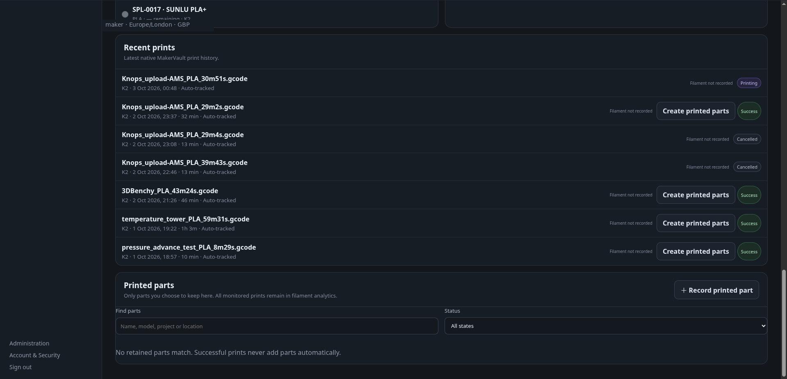

# Print history and costs

**Goal:** record what was printed, the outcome and the material actually used.

## Record a print

1. In **3D Printing**, open print history and use the print-record action.
2. Choose the owned printer and, where appropriate, model/revision and project.
3. Enter quantity, status and estimated/actual duration as applicable.
4. Add material usage rows for the physical spools used, with used filament and waste.
5. Check material cost/currency, add notes and save.

Use the exact revision printed, not just whichever model file is newest today. Record failed prints too if you want meaningful success-rate and waste information. External history imports should be checked before adding another manual record for the same job.

## How material estimates work

A spool needs an initial filament weight and purchase cost to calculate cost per gram. MakerVault estimates each usage row from:

```text
(used filament + waste) × (spool purchase cost ÷ initial filament weight)
```

Example: a 1,000 g spool costing £20 has a cost of £0.02/g. A print with 30 g used and 5 g waste estimates **£0.70** in material.

Review the shown estimate before saving; you can override it. Stored historical costs remain authoritative after creation. Changing today's spool price should not be interpreted as repricing every earlier print.

These figures represent recorded material cost. They do not automatically include electricity, machine wear, labour, postage or profit. Different currencies are kept separate rather than silently converted or added together.

## Read the overview

The overview summarises recorded print time, material consumed, waste, material cost and per-printer results. Success rates depend on the jobs and statuses recorded; missing or incomplete history makes them incomplete. Duration and usage supplied by a service can also be missing or approximate.

A history entry is not a command to start a printer. Check spool remaining weight after changes or synchronisation; do not assume a manually entered usage figure guarantees live physical weight measurement.

## Missing filament usage

Live printer monitoring can record duration, progress and the outcome without knowing the filament weight. K2/Creality telemetry does not directly supply consumed grams; uploaded G-code can provide the separately labelled estimate described below. MakerVault shows **Not recorded** for missing filament/waste totals and missing material cost. A recorded zero remains **0 g**; fractional gram values are preserved.

When only some print records contain material usage, the overview shows how many prints contribute to the total. The total covers recorded usage, not an estimate for the missing prints. CFS remaining percentages and print duration are not converted into consumed grams. Enter material usage through print history when you have a known figure.

## Automatic filament usage

Upload plain **.gcode** through **Files**. MakerVault reads explicit gram metadata from OrcaSlicer/PrusaSlicer/Bambu-style `filament used [g]` comments and supported total-weight headers. Multi-tool gram lists are summed once. Length-only files, binary .bgcode files, malformed weights and conflicting headers remain unknown.

A successfully completed live print can match an uploaded file by its original filename, within the same owner's files. Ambiguous duplicate filenames are not automatically selected. Uploading the file after completion can fill matching history too. For a manually recorded completed print, choose **Uploaded G-code estimate** in the print-history form. Use a unique original filename matching the printer's job filename for automatic matching.

Full-file weights are labelled **estimated** and count only after successful completion. A failed or cancelled print never consumes the full-file estimate. Moonraker-compatible sources can report extruded length and G-code weight/length metadata; MakerVault uses their ratio to estimate consumed grams, including partial jobs, and labels this as a printer-report estimate. Missing metadata does not break live monitoring. K2/Creality LAN telemetry does not currently supply a documented consumed-gram field; use uploaded G-code estimates for K2.

Recorded material-usage rows override the automatic total for that print. Printer consumption reports override full-file estimates. Polling replaces the same sourced total instead of repeatedly adding it. Analytics identifies estimated totals, and recent prints identify the source. These totals do **not** automatically deduct spool inventory or invent per-spool allocation, purge/waste weight or material cost.

The parser reads at most the first and last 1 MiB and never executes G-code. Parsed results are cached against the file checksum. References: [Moonraker file metadata](https://moonraker.readthedocs.io/en/latest/external_api/file_manager/) and [printer-reported filament length](https://moonraker.readthedocs.io/en/latest/printer_objects/).


<figure markdown>
  
  <figcaption>Print history remains separate from explicitly retained printed parts.</figcaption>
</figure>
