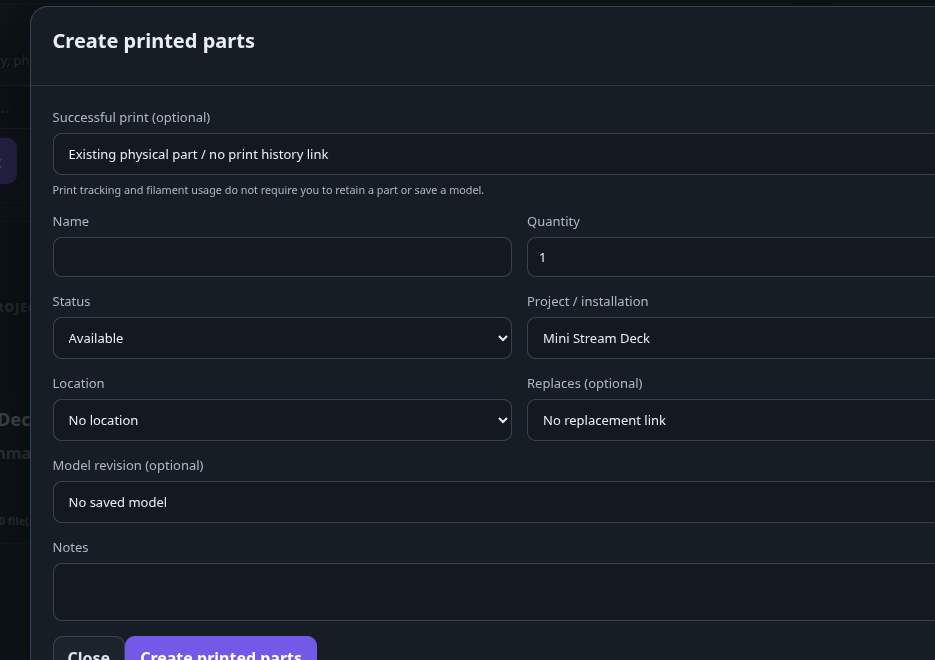

# Printed parts

Printed parts are the physical objects you choose to retain in MakerVault. A monitored print never creates a part automatically. You can print temporary objects, gifts or unrelated models without adding physical inventory or saving a model.

## Keep parts from a print

1. Open **3D Printing** and find a successful print in **Recent prints**.
2. Select **Create printed parts**. Alternatively, use **Record printed part** and select a successful print from history.
3. Name the part, confirm the total quantity produced by the print, and enter how many you want to retain. For example, a plate can produce six brackets while you retain only two.
4. Choose its physical status, location and optional project.
5. Save. Closing the form leaves physical inventory unchanged.

When a saved model revision is linked to the print, the part keeps that revision link. A saved model is optional. You can also record an existing physical part without a print-history link and optionally select its model revision.

Retained batches cannot exceed the print's recorded quantity. Repeated submissions cannot create an additional full batch once that quantity has been retained. Changing the print quantity requires permission to edit print jobs.

## Track the physical object

Use **Manage** to update quantity, location, notes and status. States are Available, Installed / in use, Spare, Failed, Scrapped and Retired. Installed parts require a project. The project's detail page shows assigned parts and lets you manage them.

Changes are recorded in **Part history**. For a reprint, create a new part linked to its new print and select **Replaces**. Mark the old part scrapped or retired when appropriate; the replacement link does not silently change the old object.

Use **Maker Tags** to assign QR, NFC or RFID identities to a **Printed part**. Scanning the tag opens its part record. A tag identifies a batch when its quantity is greater than one; record separate parts when each needs an individual identity.

## Filament accounting is independent

All confidently identified monitored print jobs can contribute to filament analytics, including unlinked models and prints whose objects you never retain. Usable printer reports or supported uploaded G-code metadata are still required. MakerVault does not infer consumption from duration, progress or CFS percentages.

A part displays material usage and cost for the **whole original print job**, where known. It does not allocate that figure to individual parts or multiply it by the retained quantity. Creating, replacing, scrapping or retiring parts never adds or subtracts filament usage. It also does not deduct physical spool inventory. See [Print history and costs](print-history.md) for sources and estimate limitations.

Production context is saved when a part is created and follows current job usage while its print job exists. If the print is later deleted, the part survives with its creation-time context. Deleting print history still removes that job from analytics; retaining a part is not a substitute for keeping your print records.

<figure markdown>
  
  <figcaption>Printed parts are created explicitly; successful prints do not create them automatically.</figcaption>
</figure>
