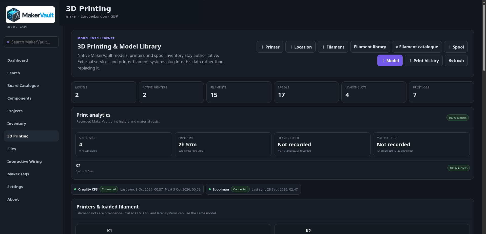
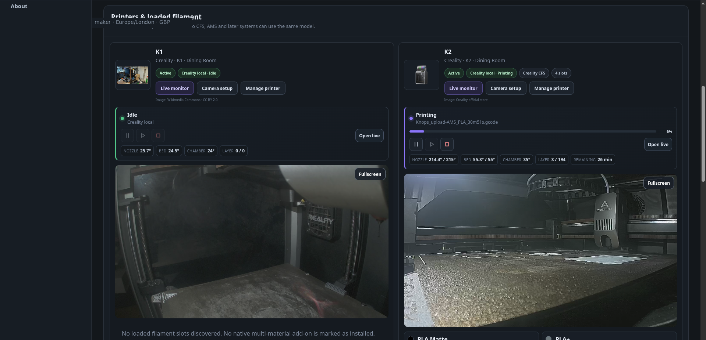
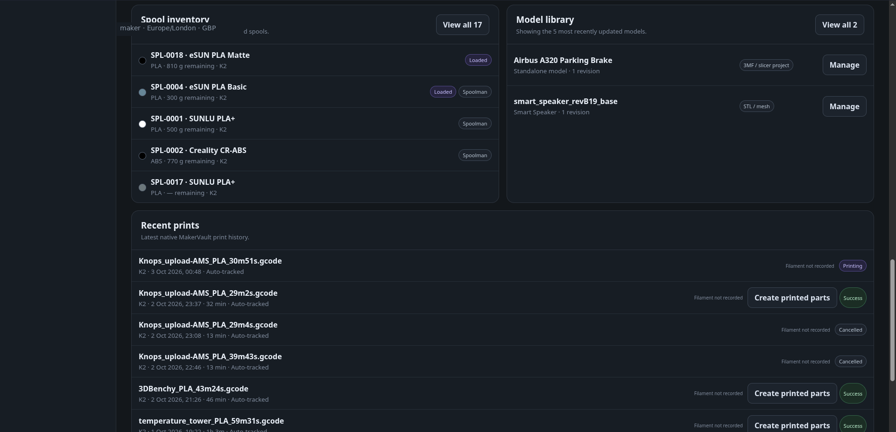

# Printers, filament and spools

**Goal:** describe your equipment and materials, then record the physical things you own.

| Record | Meaning |
| --- | --- |
| Printer model | Shared specifications for a machine type |
| Owned printer | Your particular machine, with name, location and connection details |
| Filament product | A material/product/colour definition |
| Physical spool | One actual reel with its own weight, price and identity |
| Slot | A position in a printer's multi-material system |

## Add your printer

1. Open **3D Printing** and choose the add-printer action.
2. In **Add owned printer**, select the manufacturer and model. Use the custom-model option when necessary.
3. Give the machine a recognisable name and location.
4. Review its specifications and save.
5. Use **Manage printer** to correct details later.

A printer model may support a multi-material system without your particular machine having one installed. Record the installed hardware accurately. Add a local host/IP only if an integration needs it; a normal manual printer record does not require a network connection.

Printer catalogue names may come from OrcaSlicer profiles. A catalogue entry is not proof of a working live integration or complete build-volume data.

## Add filament, then add a spool

1. Open the filament area and choose **Add filament product** or the open catalogue browser.
2. Search/choose the product or enter a custom manufacturer, material and colour. Review appearance and other details, then save/import.
3. Return to physical spools and choose **Add physical spool**.
4. Select the filament product, enter initial and remaining filament weight, purchase cost/currency and status as appropriate.
5. Choose a storage location, printer assignment or leave it unassigned. Save.

Spool IDs are generated automatically. Two identical reels should be two spool records when you need to track them separately. Colour, manufacturer and material do not uniquely identify a reel. RFID/UID can identify a specific physical spool where available.

Weight fields refer to filament amounts; do not put the combined plastic-reel-and-filament scale reading into a filament-only remaining-weight field without accounting for the empty spool.

## Match a filament to catalogue data

Catalogue matching is optional. A manually created filament remains fully usable when it is **Unmatched**.

Open **Filament details** for a saved product and choose **Match catalogue**. MakerVault ranks candidates using manufacturer, material, product-name aliases and colour information. The catalogue merges SpoolmanDB with verified supplemental manufacturer-backed records, so a result may come from more than one source. Review the source and technical values before applying a match.

A match can fill missing density, nominal/spool weight, nozzle/bed temperatures, drying information, colour metadata and source links. Incoming decimal values are rounded to MakerVault's stored precision before validation, and scheduled enrichment does not silently replace deliberate manual corrections.

After matching, use **Rematch catalogue** to choose another record or **Unmatch catalogue** to remove the link. New reversible matches restore the saved pre-match values when unmatched; older matches without a snapshot keep their current descriptive values rather than guessing. Spool Inventory shows **✓ Matched** or **Unmatched** for the shared filament product behind each physical spool.

The filament colour swatch and the square candidate-selection tick are deliberately separate controls.

## Locations and slots

Create reusable printing locations such as a room, shelf or dry box. Update the placement when moving a spool. A discovered slot may display a material and colour before it has a physical spool linked.

Use **Add to inventory** / **Identify detected physical spool** to choose whether the detected reel is an existing unloaded spool or a genuinely new one. Confirm the physical identity before linking it.

## Optional connections

Live monitoring is implemented for Creality, Moonraker/Klipper, OctoPrint, Bambu Lab local, PrusaLink, Anycubic LAN and FlashForge local. Compatible Elegoo, QIDI, Sovol, Snapmaker U1 and Voron profiles reuse Moonraker. Spoolman, Creality CFS and SimplyPrint provide complementary inventory/service integrations. Most manufacturer hardware remains experimental pending testing; these are implemented adapters, not blanket promises for every model.

K1/K2 monitoring and camera playback have owner confirmation. Add a live source through **Live monitor**; the optional second step offers camera setup. Later, use the separate **Camera setup** printer action. Visible printer/dashboard cards automatically show the last configured enabled camera, with a Fullscreen control and no setup selectors. [Camera instructions](../integrations/printer-cameras.md) explain the transport limits.

Pause, Resume and confirmed Cancel are optional per-source controls for Creality, Moonraker and OctoPrint. Hardware control validation remains separate. See [controls](../integrations/printer-controls.md) and [adapter validation](../integrations/printer-adapter-validation.md).

[Printed parts](printed-parts.md) are created explicitly. Filament tracking does not require saving a model or retaining a part.

[Spoolman setup →](../integrations/spoolman.md) · [Creality CFS →](../integrations/creality.md) · [SimplyPrint →](../integrations/simplyprint.md)

<figure markdown>
  
  <figcaption>3D Printing overview.</figcaption>
</figure>

<figure markdown>
  
  <figcaption>Printer cards combine status, optional controls, cameras and loaded material.</figcaption>
</figure>

<figure markdown>
  
  <figcaption>Spool inventory and model library.</figcaption>
</figure>
