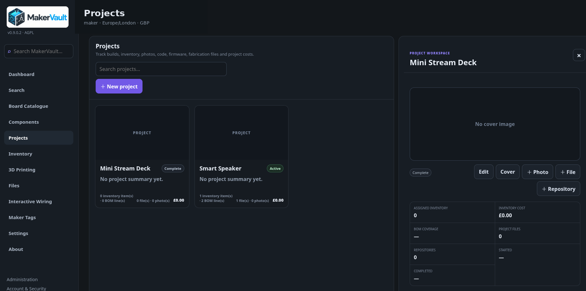
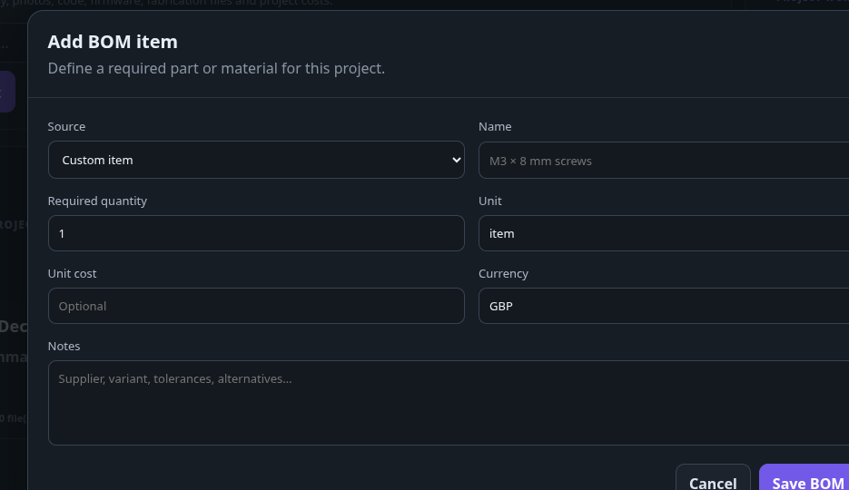

# Projects and bills of materials

A project brings the build plan, physical parts, notes, files and model revisions together.

## Create and maintain a project

1. Open **Projects → New project**.
2. Enter a name, summary, status and other useful details, then save.
3. Open the project card to view its workspace.
4. Use **Edit** for description, build notes, dates, tags and reference URL.
5. Use **Cover** and **＋ Photo** to document the build.

Keep notes actionable: wiring changes, firmware settings, assembly decisions and remaining work are useful when returning to a project months later.

## Create the bill of materials

A bill of materials (BOM) is the list of parts needed to build the project.

1. Add a BOM line in the project's BOM section.
2. Select a catalogue board/component, or enter a custom item for something outside the catalogue.
3. Enter the required quantity and unit cost where known.
4. Save and review the requirement before allocating stock.

A custom BOM line is a planning entry; it does not create a matching catalogue or inventory item automatically. Missing prices make cost totals incomplete rather than proving the build is free.

## Allocate stock

Use the line's allocation controls to select compatible inventory and reserve the quantity required. One inventory lot can serve several BOM lines/projects within its available quantity, provided project assignments and other validation rules allow it.

For example, a lot of ten connectors can reserve four for one build and two for another, leaving four free. The original quantity stays ten. Release a reservation when the plan changes.

Do not force a lower inventory quantity to make an allocation disappear. Release or correct the allocation first. Likewise, allocation does not automatically deduct stock when a project is completed; update actual inventory deliberately to reflect what happened.

## Files and repositories

Use **＋ File** to upload a project asset. Use **Upload new version** when revising an existing asset. Read confirmation text before removing a file; removing a stored asset is different from detaching a project association in Files.

Use **＋ Repository** for a Git repository URL and its relevant context. MakerVault stores a reference to that repository. It does not mirror commits, fetch source code or protect you from the remote repository being deleted.

## Costs

Project views combine relevant purchase-cost and BOM information. Treat these as recorded planning/stock figures. They are not a full accounting ledger, exchange-rate calculation or automatically reconciled invoice total. Avoid counting the same purchase twice when interpreting separate cost summaries.

<figure markdown>
  
  <figcaption>Projects collect build information, files, inventory and BOMs.</figcaption>
</figure>

<figure markdown>
  
  <figcaption>A BOM line can reference catalogue data or a custom item.</figcaption>
</figure>
